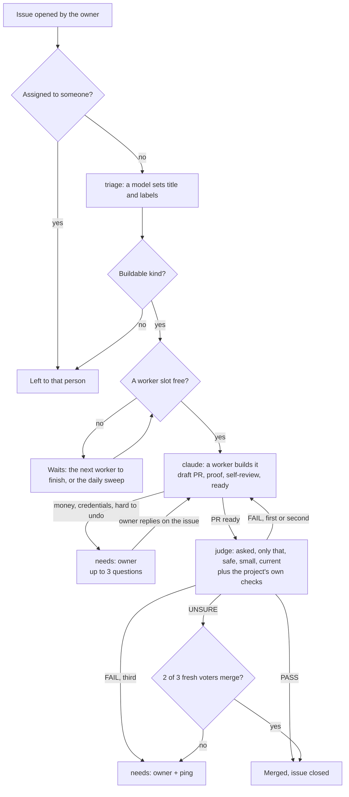

# autopilot

GitHub issues that run themselves, on Claude Code and GitHub Actions. An issue gets labelled, a Claude worker builds it
into a PR, a fresh Claude judge checks the PR against the issue and merges it. The owner is pinged only for what only
they can decide.

- Each project keeps three thin workflow files that call the reusable workflows here, one settings file, and its label
  list. Everything else (the logic, the prompts) lives here and updates by tag.
- A project changes behaviour through settings, its own `CLAUDE.md`, prompt additions and two command hooks.
- Also included: a daily sweep, auto-merging `BASE` into PRs that a merge left conflicting, a project board kept in
  sync, a review list of what merged without the owner, and releases that start once a locked milestone is done.

**See it run:** [autopilot-example](https://github.com/Leo486597/autopilot-example), a tiny project on this flow.

- [Issue #2](https://github.com/Leo486597/autopilot-example/issues/2) there ran itself.
- The agents built it into [PR #3](https://github.com/Leo486597/autopilot-example/pull/3) and merged it.

**Set up, customize, upgrade:** [AGENTS.md](AGENTS.md). It is written for the coding agent that will do the setup, so
the quickest path is to point yours at it: _"set up https://github.com/Leo486597/autopilot in this repo, following its
AGENTS.md"_.

Needs: a GitHub App for the agents to act as, and a Claude token (`claude setup-token`). [MIT licence](LICENSE).
